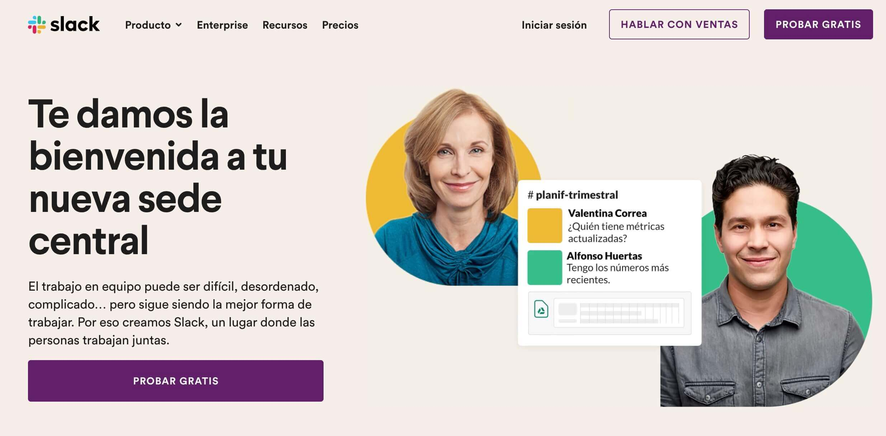
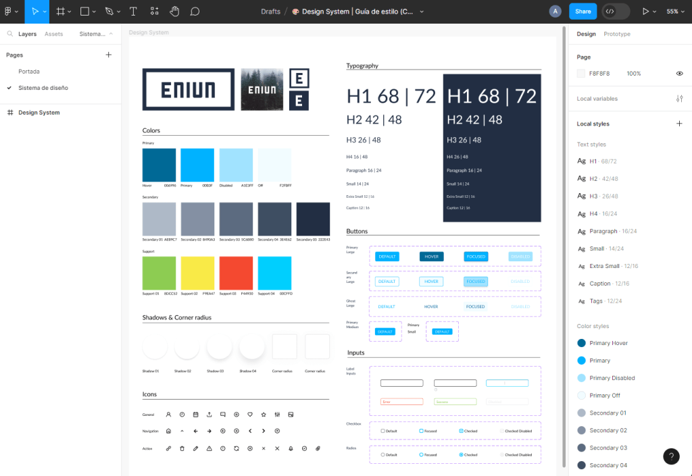
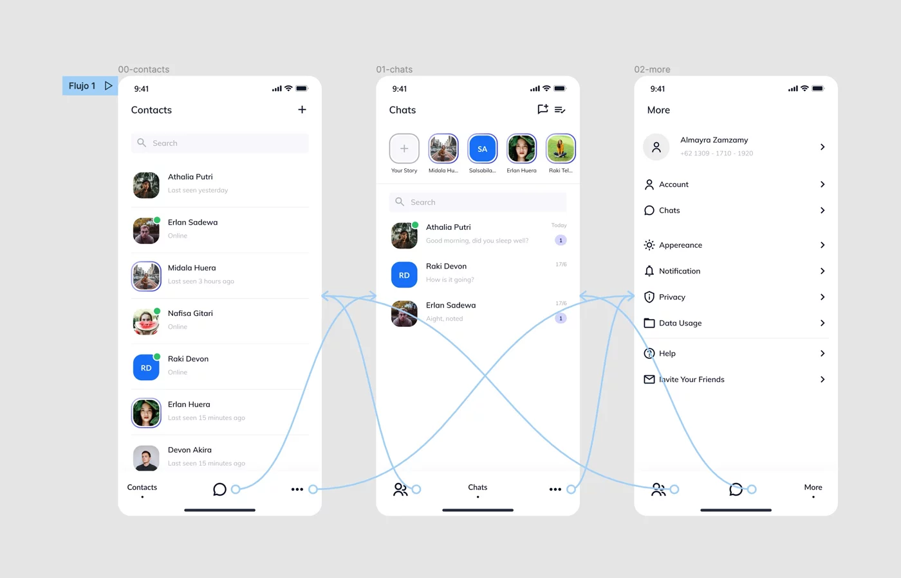
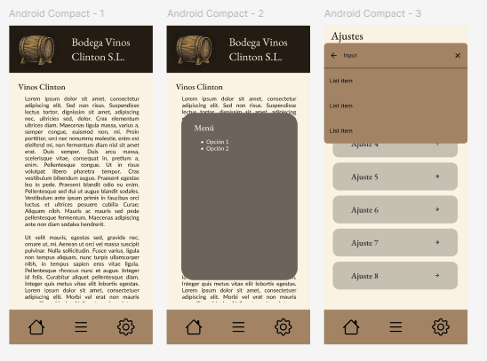

# Prototipado

### ¿Qué es un prototipo o wireframe? ¿Cuál es su papel en el proceso de diseño web?
Un **wireframe** es un esquema visual básico que representa la disposición de los elementos en una página web, sin entrar en detalles de diseño. Su principal función es planificar la estructura y facilitar la comunicación entre diseñadores, desarrolladores y clientes. Esto permite realizar ajustes antes de llegar a la implementación final.

### Menciona al menos dos herramientas para crear wireframes, que pueden ser digitales o en papel
- **Herramientas digitales:** Figma, Adobe XD  
- **Herramientas en papel:** lápiz y papel, pizarras blancas

### ¿Qué es un mapa de navegación o blueprint?
Un **mapa de navegación** es un diagrama que muestra la estructura jerárquica de un sitio web. Representa cómo se conectan las diferentes páginas y secciones, ayudando a planificar la experiencia del usuario.

---
# Landing Page
### ¿Qué es una landing page?
Una **landing page** es una página web creada con un objetivo específico, como recoger información de contacto o promocionar un producto o servicio. Está optimizada para convertir visitantes en leads o clientes.
### Ejemplo de una landing page real

---
# Layout

### ¿Qué es el layout?
El **layout** se refiere a la disposición y organización de los elementos visuales en una página web, que incluye texto, imágenes, botones y menús. Todo esto se hace para ofrecer una experiencia de usuario coherente y atractiva.

---

# Guía de Estilos (Style Guide)
### ¿Qué es una guía de estilos en el contexto del diseño web?
Una **guía de estilos** es un documento que define las normas visuales y de comunicación de una marca en su presencia digital. Esto asegura coherencia en todos los canales y plataformas.
### ¿Qué elementos incluye normalmente?
Por lo general, incluye:  
- Paleta de colores  
- Tipografías  
- Uso del logotipo  
- Estilo de imágenes  
- Componentes de interfaz (botones, formularios)  
- Tono y estilo de redacción
### Ejemplo real de guía de estilos

---
# Figma: concepto y utilidad

### ¿Qué es Figma y para qué se utiliza en diseño web?
**Figma** es una herramienta de diseño colaborativo basada en la web que permite crear interfaces de usuario y prototipos interactivos, además de facilitar la colaboración en tiempo real entre los miembros del equipo.
### Tres funcionalidades principales de Figma
1. Edición colaborativa en tiempo real  
2. Creación de prototipos interactivos  
3. Sistema de componentes reutilizables
### ¿Cómo permite Figma crear prototipos interactivos? Menciona dos funcionalidades concretas
1. **Enlaces entre pantallas:** permiten definir interacciones y transiciones  
2. **Animaciones:** posibilitan crear transiciones suaves entre los elementos para mejorar la experiencia del usuario
### Ejemplo de prototipo web real realizado en Figma

### ¿Cómo un prototipo en Figma mejora la comunicación con el cliente o el equipo de desarrollo?
Un prototipo en Figma permite visualizar y probar la interacción con la interfaz antes de implementarla. Esto facilita la retroalimentación temprana y asegura que el producto final cumpla con las expectativas del cliente y los requisitos técnicos del equipo de desarrollo.
### Prototipo básico

1. **Pantalla 1 (Inicio)**
    - Muestra la información de la bodega (“Bodega Vinos Clinton S.L.”).
    - Tiene tres botones en la parte inferior:
        - 🏠 → (Inicio) — no hace nada porque ya estamos aquí.
        - ≡ → (Menú) — lleva con un efecto disolvente (fade) a la Pantalla 2.
        - ⚙️ → (Ajustes) — lleva instantáneamente a la Pantalla 3.
2. **Pantalla 2 (Menú)**
    - Similar a la primera, pero con un cuadro que muestra opciones.
    - Los botones inferiores hacen lo siguiente:
        - 🏠 → vuelve con disolvente a la Pantalla 1.
        - ≡ → permanece (ya estás en el menú).
        - ⚙️ → va instantáneamente a la Pantalla 3.
3. **Pantalla 3 (Ajustes)**
    - Muestra una lista de opciones (“Ajuste 1”, “Ajuste 2”…).
    - El primer botón (🏠) lleva **instantáneamente** de vuelta a la Pantalla 1.